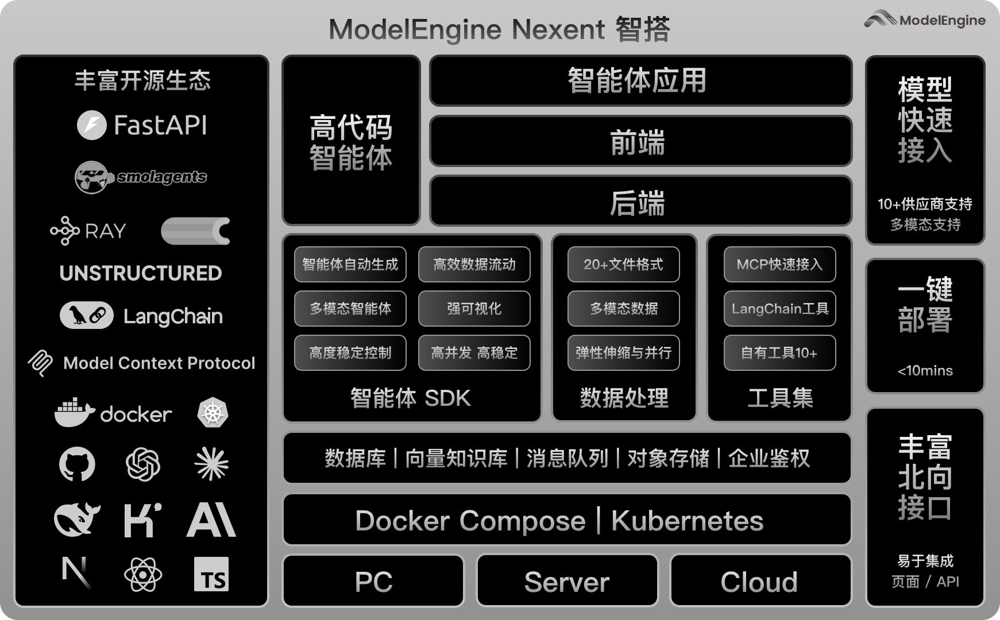

# 软件架构

Nexent 采用现代化的分布式微服务架构，旨在提供高性能、可扩展的 AI 智能体平台。整个系统基于容器化部署，支持云原生和企业级应用场景。



## 🏗️ 整体架构设计

Nexent 的软件架构遵循分层设计原则，从上到下分为以下几个核心层次：

### 🌐 前端层（Frontend Layer）
- **技术栈**：Next.js + React + TypeScript
- **功能**：用户界面、智能体交互、多模态输入处理
- **特性**：响应式设计、实时通信、国际化支持

### 🔌 API 网关层（API Gateway Layer）
- **核心服务**：FastAPI 高性能 Web 框架
- **职责**：请求路由、身份验证、API 版本管理、负载均衡
- **端口**：5010（主服务）、5012（数据处理服务）

### 🧠 业务逻辑层（Business Logic Layer）
- **智能体管理**：智能体生成、执行、监控
- **会话管理**：多轮对话、上下文维护、历史记录
- **知识库管理**：文档处理、向量化、检索
- **模型管理**：多模型支持、健康检查、负载均衡

### 📊 数据层（Data Layer）
分布式数据存储架构，包含多种专用数据库：

#### 🗄️ 结构化数据存储
- **PostgreSQL**：主数据库，存储用户信息、智能体配置、会话记录
- **端口**：5434
- **特性**：ACID 事务、关系型数据完整性

#### 🔍 搜索引擎
- **Elasticsearch**：向量数据库和全文搜索引擎
- **端口**：9210
- **功能**：向量相似度搜索、混合搜索、大规模优化

#### 💾 缓存层
- **Redis**：高性能内存数据库
- **端口**：6379
- **用途**：会话缓存、临时数据、分布式锁

#### 📁 对象存储
- **MinIO**：分布式对象存储服务
- **端口**：9010
- **功能**：文件存储、多媒体资源管理、大文件处理

## 🔧 核心服务架构

### 🤖 智能体服务（Agent Services）
```
智能体框架基于 SmolAgents，提供：
├── 智能体生成与配置
├── 工具调用与集成
├── 推理与决策执行
└── 生命周期管理
```

### 📈 数据处理服务（Data Processing Services）
```
分布式数据处理架构：
├── 实时文档处理（20+ 格式支持）
├── 批量数据处理管道
├── OCR 与表格结构提取
└── 向量化与索引构建
```

### 🌐 MCP 生态系统（MCP Ecosystem）
```
模型上下文协议工具集成：
├── 标准化工具接口
├── 插件化架构
├── 第三方服务集成
└── 自定义工具开发
```

## 🚀 分布式架构特性

### ⚡ 异步处理架构
- **基础框架**：基于 asyncio 的高性能异步处理
- **并发控制**：线程安全的并发处理机制
- **任务队列**：Celery + Ray 分布式任务执行
- **流式处理**：实时数据流和响应流处理

### 🔄 微服务设计
```
服务拆分策略：
├── nexent（主服务）- 智能体核心逻辑
├── nexent-data-process（数据处理）- 文档处理管道
├── nexent-mcp-service（MCP服务）- 工具协议服务
└── 可选服务（SSH、监控等）
```

### 🌍 容器化部署
```
Docker Compose 服务编排：
├── 应用服务容器化
├── 数据库服务隔离
├── 网络层安全配置
└── 卷挂载数据持久化
```

## 🔐 安全与扩展性

### 🛡️ 安全架构
- **身份验证**：多租户支持、用户权限管理
- **数据安全**：端到端加密、安全传输协议
- **网络安全**：服务间安全通信、防火墙配置

### 📈 可扩展性设计
- **水平扩展**：微服务独立扩展、负载均衡
- **垂直扩展**：资源池管理、智能调度
- **存储扩展**：分布式存储、数据分片

### 🔧 模块化架构
- **松耦合设计**：服务间低依赖、接口标准化
- **插件化架构**：工具和模型的热插拔
- **配置管理**：环境隔离、动态配置更新

## 🔄 数据流架构

### 📥 用户请求流
```
用户输入 → 前端验证 → API网关 → 路由分发 → 业务服务 → 数据访问 → 数据库
```

### 🤖 智能体执行流
```
用户消息 → 智能体创建 → 工具调用 → 模型推理 → 流式响应 → 结果存储
```

### 📚 知识库处理流
```
文件上传 → 临时存储 → 数据处理 → 向量化 → 知识库存储 → 索引更新
```

### ⚡ 实时处理流
```
实时输入 → 即时处理 → 智能体响应 → 流式输出
```

## 🎯 架构优势

### 🏢 企业级特性
- **高可用性**：多层冗余、故障转移
- **高性能**：异步处理、智能缓存
- **高并发**：分布式架构、负载均衡
- **监控友好**：完善的日志和状态监控

### 🔧 开发友好
- **模块化开发**：清晰的层次结构
- **标准化接口**：统一的 API 设计
- **灵活配置**：环境适配、功能开关
- **易于测试**：单元测试、集成测试支持

### 🌱 生态兼容
- **MCP 标准**：遵循模型上下文协议
- **开源生态**：集成丰富的开源工具
- **云原生**：支持 Kubernetes、Docker 部署
- **多模型支持**：兼容主流 AI 模型提供商

---

这种架构设计确保了 Nexent 能够在保持高性能的同时，为用户提供稳定、可扩展的 AI 智能体服务平台。无论是个人用户还是企业级部署，都能够获得优秀的使用体验和技术保障。