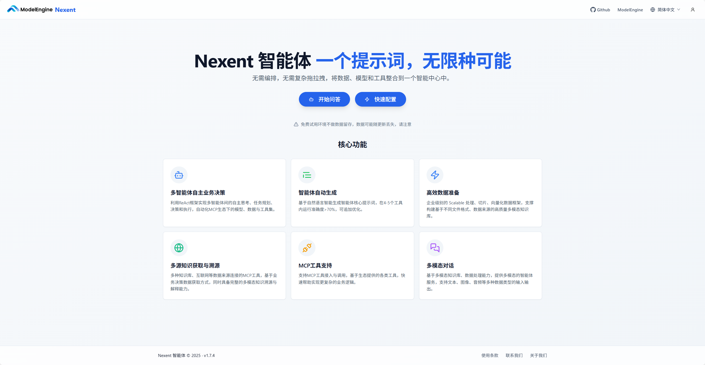

# 用户指南

Nexent是一款面向未来的零代码智能体开发平台，致力于让每个人都能轻松构建和部署专属的AI智能体，无需编程基础，也无需繁琐操作！

本用户指南将带您全面了解Nexent的强大功能和使用方法，助您快速上手各类操作~

通过学习本指南，您将能够高效利用Nexent，把创意变为现实，让智能体为您的工作和生活带来真正的价值与惊喜！

## 🚀 快速开始

在Nexent首页，您可以看到两个主要操作按钮：

1. **开始问答：** 点击后直接进入对话页面，与智能体进行交互
2. **快速配置：** 点击后进入智能体配置页面，配置您的专属智能体

此外，页面右上角还支持切换语言（简体中文或English），您可以根据需要自由切换语言。

## 💡 下一步

准备好开始了吗？建议您按照以下顺序进行配置：

1. 首先进行 **[应用配置](./app-configuration)**，为您的应用配置基本信息
2. 然后进行 **[模型配置](./model-configuration)**，接入您需要的AI模型
3. 接着进行 **[知识库配置](./knowledge-base-configuration)**，上传您的文档和资料
4. 最后进行 **[智能体配置](./agent-configuration)**，创建您的专属智能体
5. 一切就绪后，就可以在 **[对话页面](./chat-interface)** 中与智能体进行交互了

## 🧠 高级功能

除了基础配置外，Nexent还提供了强大的高级功能：

- **[记忆配置](./memory)**：了解Nexent的四层记忆架构，实现跨对话的知识累积与检索

如果您在配置过程中遇到任何问题，请参考我们的 **[常见问题](../getting-started/faq)** 或加入我们的 [Discord 社区](https://discord.gg/tb5H3S3wyv) 获取支持。 